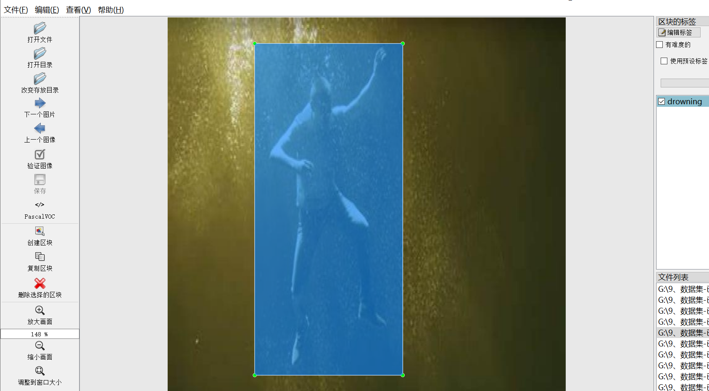
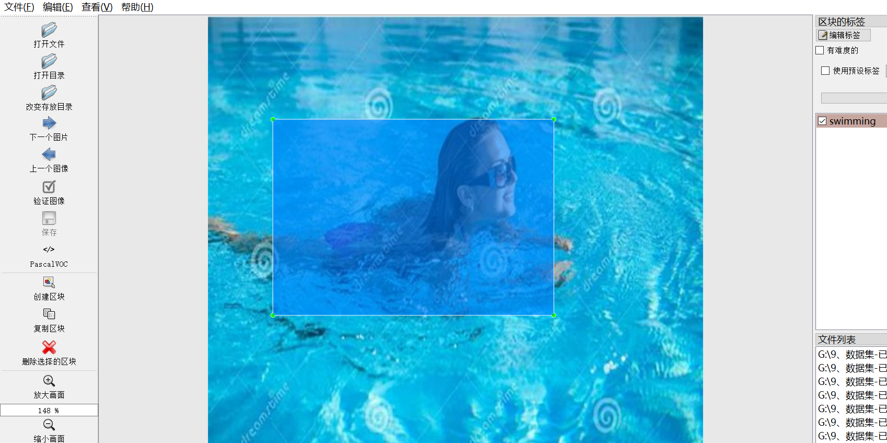
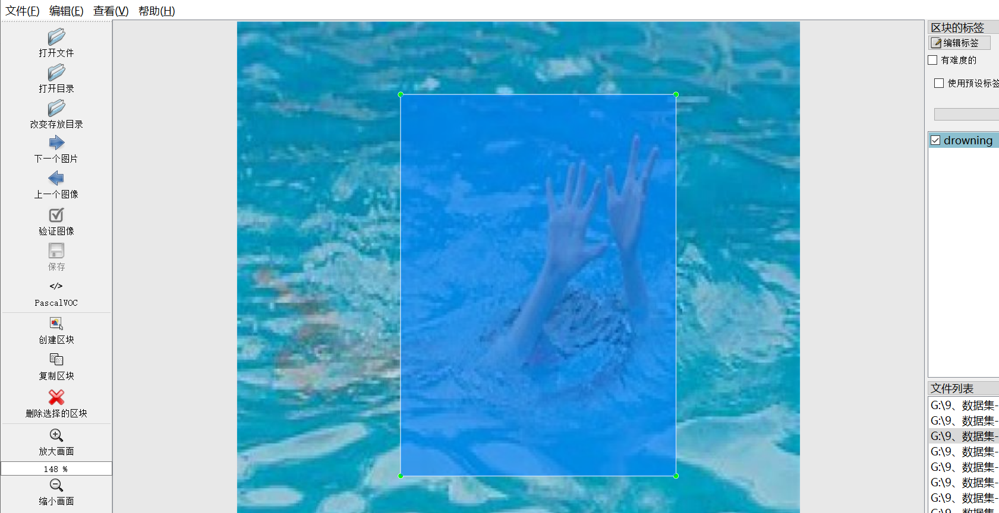

# [Dataset] Swimming Posture Judgment Personnel Inside Water Pond Drowning Water or swimming Dataset YOLO-VOC 504 images

Dataset Introduction: Determine whether the person is swimming or drowning by judging the swimming posture of the water.

Dataset Format: VOC format + YOLO format

The compressed file contains: three folders, each storing images, xml files, and text files.

Total jpg images in JPEGImages folder: 504

Total XML files in Annotations folder: 504

The total number of txt files in the labels folder is 504.

Number of tag types: 2

Tag names: ["drowning","swimming"]

Number of boxes per label:

drowning frame count = 292

swimming frame count = 307

Total boxes: 599

Picture clarity (Resolution: Pixels): Clear

Is the image enhanced: No

Shape of the label: Rectangular box, used for object detection and recognition.

Important Note: None

Special Notice: This dataset does not guarantee the accuracy or precision of the trained models or weight files. The dataset only provides accurate and reasonable annotations.

## Images

---

Here is a pay link on Stripe (https://buy.stripe.com/3cs8yP7sY87d0vu9AB). Please contact me lonlonago@foxmail.com after funding $89, and I will send you a complete data files, thank you!

